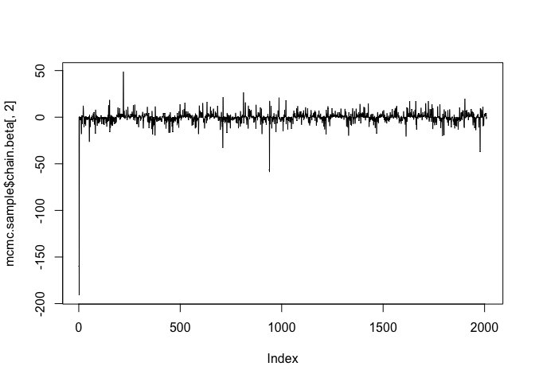
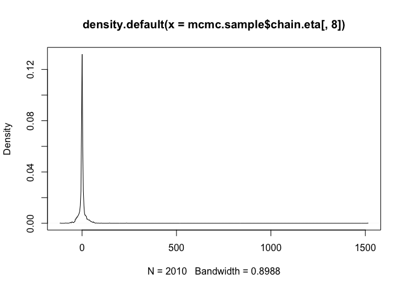

<!-- README.md is generated from README.Rmd. Please edit that file -->
mkmix
=====

El objetivo de mkmix es un modelo mixto bayesiano, aplicable al caso muy particular de estimación de elasticidad en retail.

Instalación
-----------

Puede instalar la versión de desarrollo [GitHub](https://github.com/) con:

``` r
# install.packages("devtools")
devtools::install_github("ljofre/mkmix")
```

Example
-------

este es un pequeño ejemplo de como usar la librería para nuestro set de prueba. La libreria mkmix provee un set de datos 'consumo' que son datos reales de cantidad vendida, precio, promociones y canales del retail X.

``` r
library(mkmix)
library(knitr)

estimate.mode <- function(x) {
  temp <- density(x)
  temp$x[which.max(temp$y)]
}

data("consumo")

sales.data <- mkmix::get.mkmix.object(data.frame.in = consumo,
                                      fixed.effects = c("PRENSA",
                                                        "TV",
                                                        "CATALOGO"),
                                      random.effect = "RUBRO_MARCA",
                                      log.p = "lP",
                                      log.q = "lQ")

mcmc.sample <- mkmix::constrained.mixed.model.mcmc(n.iter = 10000,
                                                   data = sales.data)
```

las estimaciones se obtienen obteniendo la moda de la distribución posterior.

``` r
ee <- matrix(nrow = ncol(mcmc.sample$chain.eta))
for(i in 1:ncol(mcmc.sample$chain.eta)) {
  ee[i,1] <-estimate.mode(mcmc.sample$chain.eta[,i])
}
```

``` r
bb <- matrix(nrow = ncol(mcmc.sample$chain.beta))
for(i in 1:ncol(mcmc.sample$chain.beta)) {
  bb[i,1] <-estimate.mode(mcmc.sample$chain.beta[,i])
}
```

las cuales generan los siguientes resultados

``` r
colnames(ee) <- c("random.effects")
kable(ee, caption = "estimacion de efectos aleatorios de subrubro marca")
```

|  random.effects|
|---------------:|
|       0.0630356|
|       0.4053852|
|       0.0634652|
|      -0.1676468|
|      -0.1384447|
|       0.3014639|
|       0.1591363|
|       0.0011668|
|      -0.0221589|
|       2.0199764|
|      -0.1453745|
|       0.0010760|
|      -0.0549243|
|       2.0473069|
|      -0.1615873|
|       0.8821548|
|       0.1499108|
|       1.1363475|
|       0.2983675|
|       1.9143643|
|       0.1665973|
|      -0.0329557|
|      -0.0277316|
|      -1.0339036|
|      -0.0477206|
|       0.9795019|
|      -0.0868570|
|       0.2910641|
|       0.1124923|
|      -0.1908808|
|      -0.1282337|
|       2.5107788|
|      -0.2368757|
|      -2.7530213|
|       0.0342896|
|       1.2197752|
|       0.1377010|
|       3.3027737|
|      -0.0228296|
|      -0.3182175|
|       0.1624784|
|      -0.8355972|
|      -0.4285345|
|      -0.2250525|
|       0.0731897|
|       0.4317082|
|       0.1244683|
|      -0.3753815|

y también

``` r
colnames(bb) <- c("fixed.effects")
kable(bb, caption = "estimacion de efectos fijos de canales de promoción: intercepto, prensa, tv, catálogo ")
```

|  fixed.effects|
|--------------:|
|      3.9761295|
|     -0.2245598|
|     -0.7229224|
|     -0.1251198|

se pueden visualizar las cadenas

``` r
# canera para el segundo efecto fijo (el primero es el intercepto)
plot(mcmc.sample$chain.beta[,2], type='l')
```



y distribuciones posteriores

``` r
# densidad empirita del 4 efecto aleatorio de la pendiente 
den.eta.4.slope <- density(mcmc.sample$chain.eta[,8])
plot(den.eta.4.slope)
```


